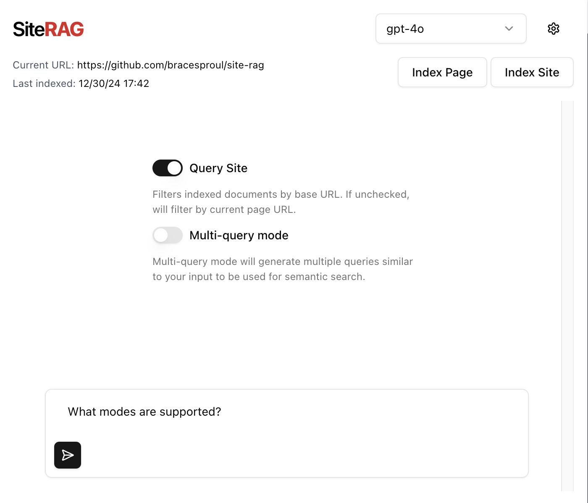

# Site RAG

[Demo video](https://www.loom.com/share/2ee8496a17774577b2684d6b2981bd1a)



A Chrome extension for asking questions over websites. Site RAG can index a single page of the website, or crawl the entire site. It then generates embeddings for the indexed documents, and stores them in a vector store database.

When a user asks a question, Site RAG will either fetch relevant documents from the current page, or the entire site (customizable).

## Requirements

- [Anthropic API key](https://console.anthropic.com/) - For LLM chat generations
- [OpenAI API key](https://platform.openai.com/) - For embeddings
- [Supabase account](https://supabase.com/) - For vector store

## Setup

First, clone the repository:

```bash
git clone https://github.com/bracesproul/site-rag.git
```

```bash
cd site-rag
```

Then, install the dependencies:

```bash
yarn install
```

and build:

```bash
yarn build
```

### Vector store

To setup the vector store, you need to create a Supabase database. Then, inside the SQL editor, run the following:

```sql
-- Enable the pgvector extension to work with embedding vectors
create extension vector;

-- Create a table to store your documents
create table documents (
  id bigserial primary key,
  content text, -- corresponds to Document.pageContent
  metadata jsonb, -- corresponds to Document.metadata
  embedding vector(3072) -- 3072 works for OpenAI embeddings, change if needed
);

-- Create a function to search for documents
create function match_documents (
  query_embedding vector(3072),
  match_count int DEFAULT null,
  filter jsonb DEFAULT '{}'
) returns table (
  id bigint,
  content text,
  metadata jsonb,
  embedding jsonb,
  similarity float
)
language plpgsql
as $$
#variable_conflict use_column
begin
  return query
  select
    id,
    content,
    metadata,
    (embedding::text)::jsonb as embedding,
    1 - (documents.embedding <=> query_embedding) as similarity
  from documents
  where metadata @> filter
  order by documents.embedding <=> query_embedding
  limit match_count;
end;
$$;

```

## Usage

To use the extension, go to [chrome://extensions/](chrome://extensions/) and click "Load unpacked". From there, select the `dist` directory of this repository.

Once loaded, open the extension and visit the settings page. Here you can add your API keys, and Supabase credentials. You can also customize the indexing settings, such as chunk size and overlap.
