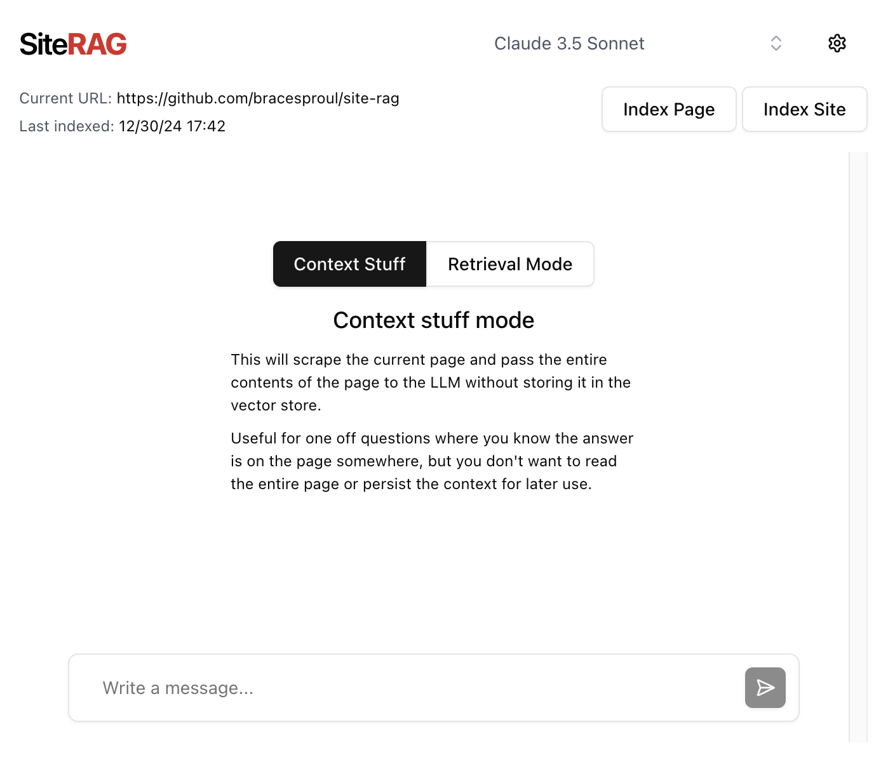
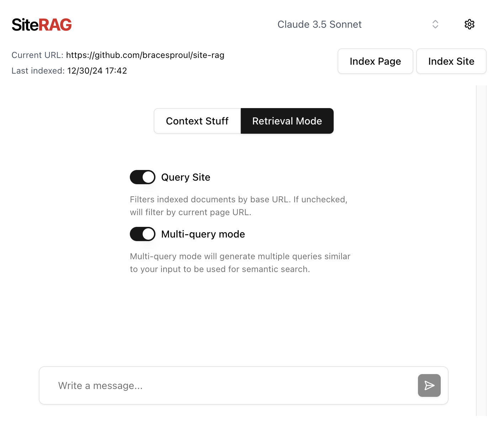

# Site RAG

[Demo video](https://www.loom.com/share/2ee8496a17774577b2684d6b2981bd1a)

<p align="center">
  
  
</p>

A Chrome extension for asking questions over websites. Site RAG can:

- Preform one off queries on the current page
- Index the current page & persist the documents in a vector store. Then preform RAG when generating a response
- Index an entire site & persist the documents in a vector store. Then preform RAG when generating a response

Site RAG runs 100% locally in your browser, storing all secrets in browser storage.

You can even connect a locally running Ollama instance to use local LLM inference with Site RAG.

## Requirements

For the quickstart (no RAG, only context stuffing) you only need _one_ of the following API keys:

- [Anthropic](https://console.anthropic.com/)
- [OpenAI](https://platform.openai.com/)
- [Google GenAI](https://aistudio.google.com/)
- [Together AI](https://api.together.ai/)

And a FireCrawl API key for scraping sites:

- [FireCrawl](https://firecrawl.dev/)

## Setup

First, clone the repository:

```bash
git clone https://github.com/bracesproul/site-rag.git
```

```bash
cd site-rag
```

Then, install the dependencies:

```bash
yarn install
```

and build:

```bash
yarn build
```

## Usage

Once built, go to [chrome://extensions/](chrome://extensions/) and click "Load unpacked". From there, select the `dist` directory of this repository.

Once loaded, open the extension and visit the settings page. Here you can add your API keys, secrets, and other configuration. Once set, scroll to the bottom and click `Save`.

Then, return to the chat view and ask your first question!

This will scrape the site you currently have the extension opened on, and use that context to answer your question.

## Advanced Setup

Site RAG also allows for integrating a vector store to persist your indexed documents. To do this, you need to create a Supabase database.

Sign up for a free Supabase account [here](http://supabase.com/).

Next, create a new project and execute this PostgreSQL command to create the necessary table and functions:

```sql
-- Enable the pgvector extension to work with embedding vectors
create extension vector;

-- Create a table to store your documents
create table documents (
  id bigserial primary key,
  content text, -- corresponds to Document.pageContent
  metadata jsonb, -- corresponds to Document.metadata
  embedding vector(3072) -- 3072 works for OpenAI embeddings, change if needed
);

-- Create a function to search for documents
create function match_documents (
  query_embedding vector(3072),
  match_count int DEFAULT null,
  filter jsonb DEFAULT '{}'
) returns table (
  id bigint,
  content text,
  metadata jsonb,
  embedding jsonb,
  similarity float
)
language plpgsql
as $$
#variable_conflict use_column
begin
  return query
  select
    id,
    content,
    metadata,
    (embedding::text)::jsonb as embedding,
    1 - (documents.embedding <=> query_embedding) as similarity
  from documents
  where metadata @> filter
  order by documents.embedding <=> query_embedding
  limit match_count;
end;
$$;

```

After setting up the vector store, you can add your credentials to the settings page of the extension.

## FAQ

#### What happens if I index the same site twice?

Site RAG will ask you if you want to delete existing documents before indexing again, so you don't have to worry about duplicates. It deletes documents by URL.

#### What is "multi query mode"?

Multi query mode will generate multiple queries based on your input message, then preform a semantic search on each generated query. Finally, using all of the results, it will remove duplicates and generate a final response.

#### How does retrieval work in followup questions?

Site RAG preforms retrieval (if you aren't using context stuffing mode) on each request by you. Once documents are retrieved, they are stored in your browser's storage with a `sessionID` tying them to your current chat session. Then, in followup questions the context from the most recent question will be included in the system prompt, and previous context will be passed as `user` messages before each of your previous requests, so the model always has the full context.

#### How does context stuff work?

Context stuff mode will scrape the current page, then store those results in your browser's storage. Then, each time you send a request using context stuffing mode, it will include the entire contents of the page in the system prompt.
